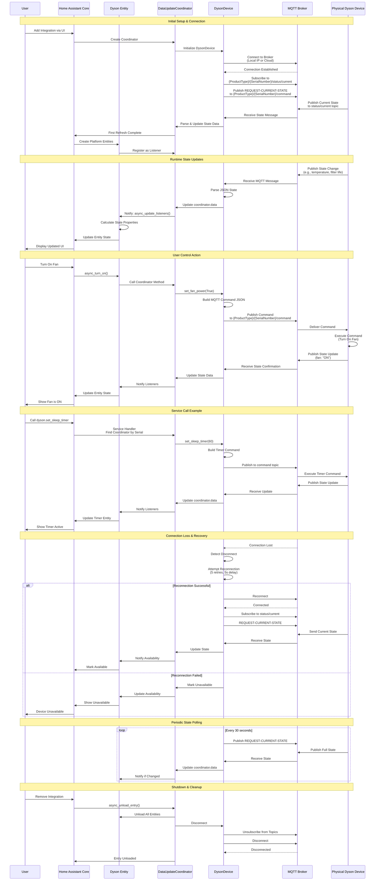

# Dyson Integration Flow Diagrams

This document contains visual diagrams of the Dyson Home Assistant integration architecture and operation flow.

## Overview

The Dyson integration follows a modular architecture with clear separation of concerns:

- **Config Flow**: Handles user setup and authentication
- **Coordinators**: Manage device state and cloud account operations
- **Device Layer**: Abstracts MQTT communication and connection management
- **Platform Entities**: Provide Home Assistant entity interfaces
- **Services**: Expose advanced device features

## Table of Contents

1. [Integration Flow Diagram](#integration-flow-diagram) - Complete setup and operational flow
2. [Component Architecture](#component-architecture-diagram) - Component relationships
3. [MQTT Communication Flow](#mqtt-communication-sequence-diagram) - Detailed message flow

---

## Integration Flow Diagram

This flowchart shows the complete journey from initial setup through runtime operation:

- **Setup Phase**: User configuration via UI or YAML
- **Entry Creation**: Config flow processes and validates inputs
- **Device Connection**: MQTT communication establishment
- **Platform Setup**: Dynamic platform creation based on capabilities
- **Runtime Operation**: Real-time state updates and user controls

```mermaid
flowchart TB
    Start[User Initiates Setup] --> ConfigChoice{Setup Method}

    ConfigChoice -->|UI Configuration| ConfigFlow[Config Flow]
    ConfigChoice -->|YAML Configuration| YAMLSetup[async_setup]

    ConfigFlow --> SetupType{Setup Type}
    SetupType -->|Cloud Account| CloudAuth[Cloud Authentication]
    SetupType -->|Manual Device| ManualSetup[Manual Device Setup]

    CloudAuth --> AuthSteps[1. Enter Email/Password<br/>2. Get OTP Code<br/>3. Verify OTP<br/>4. Get Auth Token]
    AuthSteps --> CloudOptions[Configure Cloud Options]
    CloudOptions --> AutoAdd{Auto-Add Devices?}
    AutoAdd -->|Yes| DevicePolling{Enable Polling?}
    AutoAdd -->|No| CreateCloudEntry[Create Account Entry]
    DevicePolling -->|Yes| CreateCloudEntry
    DevicePolling -->|No| CreateCloudEntry

    ManualSetup --> ManualSteps[1. Enter Serial Number<br/>2. Choose Connection Type<br/>3. Enter Network Details<br/>4. Configure MQTT]
    ManualSteps --> CreateDeviceEntry[Create Device Entry]

    YAMLSetup --> ParseYAML[Parse YAML Config]
    ParseYAML --> ImportFlow[async_init with SOURCE_IMPORT]
    ImportFlow --> CreateDeviceEntry

    CreateCloudEntry --> EntryType{Entry Contains<br/>Devices List?}
    CreateDeviceEntry --> EntryType

    EntryType -->|Yes - Account Entry| AccountSetup[_setup_account_level_entry]
    EntryType -->|No - Device Entry| DeviceSetup[_setup_individual_device_entry]

    AccountSetup --> CreateCloudCoord[Create DysonCloudAccountCoordinator]
    CreateCloudCoord --> PollDevices{Polling Enabled?}
    PollDevices -->|Yes| StartPolling[async_config_entry_first_refresh<br/>Start Polling Loop]
    PollDevices -->|No| CheckAutoAdd{Auto-Add Enabled?}
    StartPolling --> CheckAutoAdd

    CheckAutoAdd -->|Yes| AutoCreateDevices[Automatically Create<br/>Device Entries]
    CheckAutoAdd -->|No| CreateDiscovery[Create Discovery Flows<br/>for User Confirmation]

    AutoCreateDevices --> CreateDeviceEntry
    CreateDiscovery --> UserConfirm[User Confirms Device]
    UserConfirm --> CreateDeviceEntry

    DeviceSetup --> CreateDeviceCoord[Create DysonDataUpdateCoordinator]
    CreateDeviceCoord --> InitDevice[Initialize DysonDevice Object]

    InitDevice --> ConnType{Connection Type}
    ConnType -->|Local Only| LocalConn[Connect via MQTT to Local IP]
    ConnType -->|Cloud Only| CloudConn[Connect via Cloud API]
    ConnType -->|Local with Cloud Fallback| LocalFirst[Try Local, Fall Back to Cloud]
    ConnType -->|Cloud with Local Fallback| CloudFirst[Try Cloud, Fall Back to Local]

    LocalConn --> EstablishMQTT[Establish MQTT Connection]
    CloudConn --> EstablishCloud[Establish Cloud Connection]
    LocalFirst --> EstablishMQTT
    CloudFirst --> EstablishCloud

    EstablishMQTT --> RequestState[Send MQTT Command:<br/>REQUEST-CURRENT-STATE]
    EstablishCloud --> RequestState

    RequestState --> WaitResponse{Response Received?}
    WaitResponse -->|No| ConnError[ConnectionError/Timeout]
    WaitResponse -->|Yes| ParseState[Parse Device State]

    ConnError --> Unsupported{UnsupportedDevice<br/>Error?}
    Unsupported -->|Yes| RemoveEntry[Auto-Remove Entry]
    Unsupported -->|No| NotReady[Raise ConfigEntryNotReady]

    ParseState --> DetectCaps[Detect Device Capabilities]
    DetectCaps --> CheckFirmware[async_check_firmware_update]
    CheckFirmware --> RegisterServices[async_setup_device_services_for_coordinator]

    RegisterServices --> DetermineCateg{Device Category}
    DetermineCateg -->|ec - Environment Cleaner| ECServices[Register EC Services:<br/>- set_sleep_timer<br/>- set_continuous_monitoring<br/>- etc.]
    DetermineCateg -->|robot - Robot Vacuum| RobotServices[Register Robot Services:<br/>- start_cleaning<br/>- set_cleaning_mode<br/>- etc.]
    DetermineCateg -->|vacuum - Vacuum| VacuumServices[Register Vacuum Services]
    DetermineCateg -->|flrc - Floor Cleaner| FLRCServices[Register FLRC Services]

    ECServices --> PlatformSetup[_get_platforms_for_device]
    RobotServices --> PlatformSetup
    VacuumServices --> PlatformSetup
    FLRCServices --> PlatformSetup

    PlatformSetup --> CapCheck{Check Capabilities}
    CapCheck --> Platforms[Setup Platforms:<br/>- Fan Platform<br/>- Sensor Platform<br/>- Binary Sensor Platform<br/>- Climate Platform<br/>- Switch Platform<br/>- Number Platform<br/>- Select Platform<br/>- Button Platform<br/>- Vacuum Platform<br/>- Humidifier Platform]

    Platforms --> CreateEntities[Each Platform Creates Entities]
    CreateEntities --> EntityInit[Entities Initialize with Coordinator]

    EntityInit --> DeviceInfo[Link to Device via device_info]
    DeviceInfo --> RegisterHADevReg[Register with HA Device Registry]
    RegisterHADevReg --> SetupComplete[Setup Complete]

    SetupComplete --> Runtime[Runtime Operation]

    Runtime --> DataLoop[Coordinator Data Update Loop]
    DataLoop --> MQTTListen[Listen for MQTT State Changes]

    MQTTListen --> StateMsg{State Message<br/>Received?}
    StateMsg -->|Yes| UpdateCache[Update coordinator.data]
    StateMsg -->|No| PollInterval[Wait for Poll Interval]

    UpdateCache --> NotifyEntities[async_update_listeners]
    NotifyEntities --> EntitiesUpdate[All Entities Update Their State]

    EntitiesUpdate --> StateProps[Entities Calculate State Properties:<br/>- state<br/>- attributes<br/>- availability]

    StateProps --> HAUpdate[Home Assistant UI Updates]
    HAUpdate --> MQTTListen

    PollInterval --> RequestState

    Runtime --> UserAction[User Action via HA UI]
    UserAction --> EntityMethod[Entity Method Called:<br/>- async_turn_on<br/>- async_set_percentage<br/>- async_set_temperature<br/>- etc.]

    EntityMethod --> CoordMethod[Coordinator Device Method]
    CoordMethod --> DeviceMethod[DysonDevice Method]
    DeviceMethod --> SendMQTT[Send MQTT Command to Device]

    SendMQTT --> DeviceExecute[Physical Device Executes]
    DeviceExecute --> DeviceResponse[Device Sends State Update via MQTT]
    DeviceResponse --> StateMsg

    Runtime --> ServiceCall[User Calls Service:<br/>dyson.set_sleep_timer<br/>dyson.set_oscillation_angle<br/>etc.]
    ServiceCall --> ServiceHandler[Service Handler Function]
    ServiceHandler --> FindCoord[Find Coordinator by Serial Number]
    FindCoord --> CoordMethod

    Runtime --> Unload{User Removes<br/>Integration?}
    Unload -->|Yes| UnloadEntry[async_unload_entry]

    UnloadEntry --> UnloadPlatforms[Unload All Platforms]
    UnloadPlatforms --> RemoveServices[async_remove_device_services_for_coordinator]
    RemoveServices --> DisconnectDevice[Disconnect MQTT/Cloud]
    DisconnectDevice --> CleanupData[Remove from hass.data]
    CleanupData --> End[Entry Unloaded]

    style Start fill:#90EE90
    style SetupComplete fill:#87CEEB
    style Runtime fill:#FFD700
    style End fill:#FFA07A
    style ConnError fill:#FF6B6B
    style NotReady fill:#FF6B6B
    style RemoveEntry fill:#FF6B6B
```

### Key Flow Points

1. **Setup Flexibility**: Supports UI, YAML, and programmatic setup
2. **Cloud Integration**: Optional cloud authentication with OTP
3. **Manual Configuration**: Direct device setup for advanced users
4. **Auto-Discovery**: Cloud accounts can auto-discover and add devices
5. **Connection Types**: Four connection strategies for reliability
6. **Capability Detection**: Automatic platform setup based on device features
7. **Service Registration**: Dynamic service registration per device category
8. **Real-time Updates**: MQTT-based state synchronization
9. **Error Handling**: Graceful failure with ConfigEntryNotReady
10. **Clean Shutdown**: Proper resource cleanup on unload

---

## Component Architecture Diagram

This diagram shows how all components interact and data flows through the system:

```mermaid
graph TB
    subgraph "User Interface"
        UI[Home Assistant UI]
        YAML[YAML Configuration]
        Services[Service Calls]
    end

    subgraph "Integration Entry Points"
        ConfigFlow[DysonConfigFlow<br/>Config Flow Handler]
        AsyncSetup[async_setup<br/>YAML Import]
        AsyncSetupEntry[async_setup_entry<br/>Entry Setup]
    end

    subgraph "Coordinators"
        CloudCoord[DysonCloudAccountCoordinator<br/>- Device Discovery<br/>- Cloud Polling<br/>- Auth Token Management]
        DeviceCoord[DysonDataUpdateCoordinator<br/>- Device State<br/>- MQTT Communication<br/>- Firmware Updates<br/>- Service Registration]
    end

    subgraph "Device Layer"
        DysonDevice[DysonDevice<br/>- MQTT Connection<br/>- State Parsing<br/>- Command Execution<br/>- Connection Failover]
    end

    subgraph "Platform Entities"
        Fan[Fan Entity<br/>- Speed Control<br/>- Oscillation<br/>- Auto Mode]
        Climate[Climate Entity<br/>- Temperature<br/>- Heating/Cooling<br/>- Mode]
        Sensor[Sensor Entities<br/>- Air Quality<br/>- Temperature<br/>- Humidity<br/>- Filter Life]
        BinarySensor[Binary Sensor<br/>- Filter Status<br/>- Connection Status]
        Switch[Switch Entities<br/>- Night Mode<br/>- Heat Mode<br/>- Features]
        Select[Select Entities<br/>- Fan Mode<br/>- Oscillation Angle]
        Number[Number Entities<br/>- Timer Values<br/>- Thresholds]
        Button[Button Entities<br/>- Reset Filter<br/>- Identify]
        Vacuum[Vacuum Entity<br/>- Cleaning Control<br/>- Zones]
        Humidifier[Humidifier Entity<br/>- Humidity Control]
    end

    subgraph "External Services"
        DysonAPI[Dyson Cloud API<br/>- Authentication<br/>- Device List<br/>- Firmware Info]
        MQTT[MQTT Broker<br/>- Device Communication<br/>- State Updates<br/>- Commands]
    end

    subgraph "Home Assistant Core"
        DeviceRegistry[Device Registry]
        EntityRegistry[Entity Registry]
        HAData[Integration Data Storage]
    end

    %% User interactions
    UI -->|Setup| ConfigFlow
    YAML -->|Import| AsyncSetup
    Services -->|Call| DeviceCoord

    %% Entry setup flow
    ConfigFlow -->|Create Entry| AsyncSetupEntry
    AsyncSetup -->|Create Entry| AsyncSetupEntry

    %% Coordinator creation
    AsyncSetupEntry -->|Account Entry| CloudCoord
    AsyncSetupEntry -->|Device Entry| DeviceCoord

    %% Cloud coordinator operations
    CloudCoord -->|Poll Devices| DysonAPI
    CloudCoord -->|Discover Devices| ConfigFlow
    CloudCoord -->|Create Entries| AsyncSetupEntry

    %% Device coordinator operations
    DeviceCoord -->|Initialize| DysonDevice
    DeviceCoord -->|Check Firmware| DysonAPI
    DeviceCoord -->|Store Coordinator| HAData

    %% Device layer
    DysonDevice -->|Local Connection| MQTT
    DysonDevice -->|Cloud Fallback| DysonAPI
    DysonDevice -->|State Updates| DeviceCoord

    %% Platform setup
    DeviceCoord -->|Create| Fan
    DeviceCoord -->|Create| Climate
    DeviceCoord -->|Create| Sensor
    DeviceCoord -->|Create| BinarySensor
    DeviceCoord -->|Create| Switch
    DeviceCoord -->|Create| Select
    DeviceCoord -->|Create| Number
    DeviceCoord -->|Create| Button
    DeviceCoord -->|Create| Vacuum
    DeviceCoord -->|Create| Humidifier

    %% Entity registration
    Fan -->|Register| DeviceRegistry
    Fan -->|Register| EntityRegistry
    Climate -->|Register| DeviceRegistry
    Sensor -->|Register| DeviceRegistry

    %% Entity data flow
    DeviceCoord -->|State Updates| Fan
    DeviceCoord -->|State Updates| Climate
    DeviceCoord -->|State Updates| Sensor
    DeviceCoord -->|State Updates| BinarySensor
    DeviceCoord -->|State Updates| Switch
    DeviceCoord -->|State Updates| Select
    DeviceCoord -->|State Updates| Number
    DeviceCoord -->|State Updates| Vacuum
    DeviceCoord -->|State Updates| Humidifier

    %% User control flow
    UI -->|Control| Fan
    UI -->|Control| Climate
    UI -->|Control| Switch
    UI -->|Control| Select
    UI -->|Control| Number
    UI -->|Control| Button
    UI -->|Control| Vacuum
    UI -->|Control| Humidifier

    %% Entity actions
    Fan -->|Commands| DeviceCoord
    Climate -->|Commands| DeviceCoord
    Switch -->|Commands| DeviceCoord
    Select -->|Commands| DeviceCoord
    Number -->|Commands| DeviceCoord
    Button -->|Commands| DeviceCoord
    Vacuum -->|Commands| DeviceCoord
    Humidifier -->|Commands| DeviceCoord

    %% MQTT communication
    MQTT -->|State Messages| DysonDevice
    DysonDevice -->|Commands| MQTT

    %% API communication
    DysonAPI -->|Device Info| CloudCoord
    DysonAPI -->|Firmware Info| DeviceCoord

    style UI fill:#E8F5E9
    style ConfigFlow fill:#FFF3E0
    style CloudCoord fill:#E3F2FD
    style DeviceCoord fill:#E1F5FE
    style DysonDevice fill:#F3E5F5
    style DysonAPI fill:#FCE4EC
    style MQTT fill:#FCE4EC
    style Fan fill:#C8E6C9
    style Climate fill:#C8E6C9
    style Sensor fill:#C8E6C9
```

### Architecture Layers

1. **User Interface Layer**
   - Home Assistant UI for user interaction
   - YAML configuration for declarative setup
   - Service calls for advanced operations

2. **Integration Entry Layer**
   - Config flow for interactive setup
   - async_setup for YAML imports
   - async_setup_entry for entry initialization

3. **Coordinator Layer**
   - Cloud account management and device discovery
   - Device state management and MQTT handling
   - Firmware update coordination

4. **Device Layer**
   - MQTT connection management
   - State parsing and command building
   - Connection failover logic

5. **Entity Layer**
   - Platform-specific entity implementations
   - Home Assistant entity protocols
   - Device capability exposure

6. **External Services**
   - Dyson Cloud API for authentication and metadata
   - MQTT broker for real-time device communication

7. **Home Assistant Core**
   - Device and entity registries
   - Integration data storage

---

## MQTT Communication Sequence Diagram

This sequence diagram shows the detailed message flow during device operation:

### MQTT Communication Patterns

1. **Initial Connection**
   - Connect to MQTT broker (local or cloud)
   - Subscribe to device status topic
   - Request current state

2. **State Updates**
   - Device publishes state changes automatically
   - Integration receives and parses JSON state
   - Coordinator notifies all listening entities
   - Home Assistant UI updates

3. **Control Commands**
   - User action triggers entity method
   - Entity calls coordinator device method
   - Device builds MQTT command JSON
   - Command published to device command topic
   - Device executes and confirms with state update

4. **Service Calls**
   - Advanced features via dyson.* services
   - Service handler finds coordinator by serial number
   - Same command flow as entity controls

5. **Connection Recovery**
   - Automatic reconnection on connection loss
   - 5 retry attempts with 5-second delays
   - State resynchronization after reconnection
   - Availability tracking for entities

6. **Periodic Polling**
   - REQUEST-CURRENT-STATE every 30 seconds
   - Ensures state consistency
   - Detects manual changes on device

7. **Clean Shutdown**
   - Unsubscribe from all topics
   - Disconnect from MQTT broker
   - Proper resource cleanup

---

## Related Documentation

- [Setup Guide](SETUP.md) - Initial configuration instructions
- [Supported Devices](SUPPORTED_DEVICES.md) - Compatible Dyson models
- [Entities Reference](ENTITIES.md) - Available entity types
- [Services Reference](ACTIONS.md) - Service call documentation
- [Troubleshooting](TROUBLESHOOTING.md) - Common issues and solutions
- [Developer Guide](DEVELOPERS_GUIDE.md) - Contributing guidelines

---

## Viewing These Diagrams

These Mermaid diagrams can be viewed in:

- **GitHub**: Automatically rendered in markdown files
- **VS Code**: Install the "Markdown Preview Mermaid Support" extension
- **Mermaid Live Editor**: Copy diagram code to https://mermaid.live
- **Documentation Sites**: Most modern documentation generators support Mermaid

---

*Last Updated: February 11, 2026*
