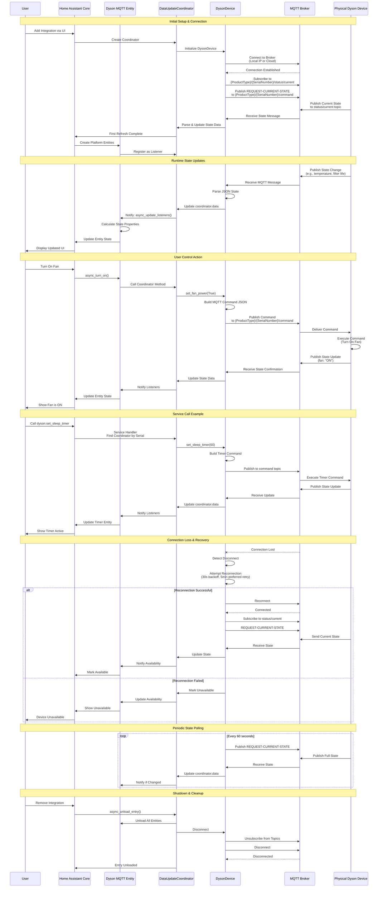
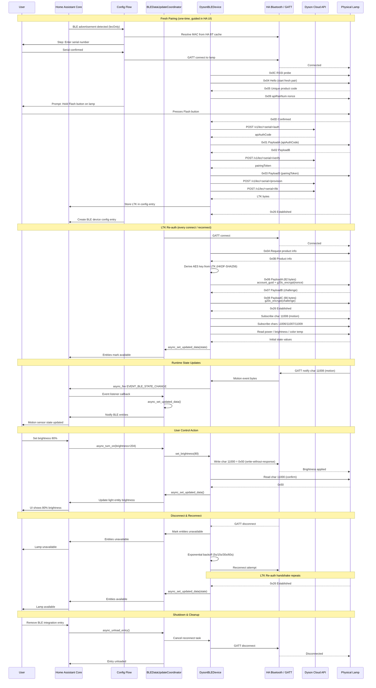

# Dyson Integration Flow Diagrams

This document contains visual diagrams of the Dyson Home Assistant integration architecture and operation flow.

## Overview

The Dyson integration follows a modular architecture with clear separation of concerns:

- **Config Flow**: Handles user setup, authentication, and BLE device pairing
- **Coordinators**: Manage device state, cloud account operations, and BLE connections
- **Device Layer**: Abstracts MQTT communication, BLE GATT communication, and connection management
- **Platform Entities**: Provide Home Assistant entity interfaces
- **Services**: Expose advanced device features

## Table of Contents

1. [Integration Flow Diagram](#integration-flow-diagram) - Complete setup and operational flow
2. [Component Architecture](#component-architecture-diagram) - Component relationships
3. [MQTT Communication Flow](#mqtt-communication-sequence-diagram) - Detailed MQTT message flow
4. [BLE Communication Flow](#ble-communication-sequence-diagram) - BLE device message flow

---

## Integration Flow Diagram

This flowchart shows the complete journey from initial setup through runtime operation:

- **Setup Phase**: User configuration via UI or YAML
- **Entry Creation**: Config flow processes and validates inputs
- **Device Connection**: MQTT communication establishment
- **Platform Setup**: Dynamic platform creation based on capabilities
- **Runtime Operation**: Real-time state updates and user controls

```mermaid
flowchart TB
    Start[User Initiates Setup] --> ConfigChoice{Setup Method}

    ConfigChoice -->|UI Configuration| ConfigFlow[Config Flow]
    ConfigChoice -->|YAML Configuration| YAMLSetup[async_setup]

    ConfigFlow --> SetupType{Setup Type}
    SetupType -->|Cloud Account| CloudAuth[Cloud Authentication]
    SetupType -->|Manual Device| ManualSetup[Manual Device Setup]
    SetupType -->|BLE Device Discovery| BLEDiscovery[BLE Device Discovered<br/>lecOnly connection category]

    CloudAuth --> AuthSteps[1. Enter Email<br/>2. Receive OTP to Email/SMS<br/>3. OTP Code +/- Password<br/>4. Choose Connection Type<br/>5. Discover Devices from Cloud]
    AuthSteps --> CloudOptions[Configure Cloud Preferences]
    CloudOptions --> AutoAdd{Auto-Add Devices?}
    AutoAdd -->|Yes| DevicePolling{Enable Polling?}
    AutoAdd -->|No| CreateCloudEntry[Create Account Entry]
    DevicePolling -->|Yes| CreateCloudEntry
    DevicePolling -->|No| CreateCloudEntry

    BLEDiscovery --> BLEConfigure[async_step_ble_configure<br/>Resolve MAC from HA BT Cache]
    BLEConfigure --> BLEPaired{LTK Already<br/>Stored?}
    BLEPaired -->|Yes| CreateBLEEntry[Create BLE Device Entry]
    BLEPaired -->|No| FreshPair[Guided Fresh Pairing Flow<br/>in HA UI]
    FreshPair --> FreshPairSteps[1. Connect to lamp via GATT<br/>2. Send Hello + RSSI probe<br/>3. Prompt user: hold Flash button<br/>4. Cloud: POST /v1/lec/auth<br/>5. Send PayloadA → receive PayloadB<br/>6. Cloud: POST /v1/lec/verify<br/>7. Send Payload3<br/>8. Cloud: POST /v1/lec/provision + ltk<br/>9. Store LTK locally]
    FreshPairSteps --> CreateBLEEntry
    CreateBLEEntry --> BLEEntrySetup[_setup_ble_device_entry]
    BLEEntrySetup --> CreateBLECoord[Create DysonBLEDataUpdateCoordinator]
    CreateBLECoord --> BLEConnect[Connect via GATT<br/>LTK Re-auth]
    BLEConnect --> BLEReauth[LTK Re-auth Handshake<br/>0x0A → 0x0B → 0x06 PayloadA<br/>→ 0x07 PayloadB → 0x08 PayloadC<br/>→ 0x26 Established]
    BLEReauth --> BLEReadState[Read Initial State:<br/>Power / Brightness / Color Temp]
    BLEReadState --> BLESubscribe[Subscribe GATT Notifications:<br/>Char 11008 Motion<br/>Chars 11006/11007/11009 Diagnostics]
    BLESubscribe --> BLEPlatforms[Setup Light Platform:<br/>- DysonLightEntity<br/>- DysonMotionBinarySensor]
    BLEPlatforms --> SetupComplete

    ManualSetup --> ManualSteps[Configure Device Details:<br/>- Serial Number<br/>- MQTT Credential and Prefix<br/>- Hostname - optional, mDNS fallback<br/>- Device Category and Capabilities]
    ManualSteps --> CreateDeviceEntry[Create Device Entry]

    YAMLSetup --> ParseYAML[Parse YAML Config]
    ParseYAML --> ImportFlow[async_init with SOURCE_IMPORT]
    ImportFlow --> CreateDeviceEntry

    CreateCloudEntry --> EntryType{Entry Contains<br/>Devices List?}
    CreateDeviceEntry --> EntryType

    EntryType -->|Yes - Account Entry| AccountSetup[_setup_account_level_entry]
    EntryType -->|No - Device Entry| DeviceSetup[_setup_individual_device_entry]

    AccountSetup --> CreateCloudCoord[Create DysonCloudAccountCoordinator]
    CreateCloudCoord --> PollDevices{Polling Enabled?}
    PollDevices -->|Yes| StartPolling[async_config_entry_first_refresh<br/>Start Polling Loop]
    PollDevices -->|No| CheckAutoAdd{Auto-Add Enabled?}
    StartPolling --> CheckAutoAdd

    CheckAutoAdd -->|Yes| AutoCreateDevices[Automatically Create<br/>Device Entries]
    CheckAutoAdd -->|No| CreateDiscovery[Create Discovery Flows<br/>for User Confirmation]

    AutoCreateDevices --> CreateDeviceEntry
    CreateDiscovery --> UserConfirm[User Confirms Device]
    UserConfirm --> CreateDeviceEntry

    DeviceSetup --> CreateDeviceCoord[Create DysonDataUpdateCoordinator]
    CreateDeviceCoord --> InitDevice[Initialize DysonDevice Object]

    InitDevice --> ConnType{Connection Type}
    ConnType -->|Local Only| LocalConn[Connect via MQTT to Local IP]
    ConnType -->|Cloud Only| CloudConn[Connect via Cloud API]
    ConnType -->|Local with Cloud Fallback| LocalFirst[Try Local, Fall Back to Cloud]
    ConnType -->|Cloud with Local Fallback| CloudFirst[Try Cloud, Fall Back to Local]
    ConnType -->|BLE Only - lecOnly| BLEConnect

    LocalConn --> EstablishMQTT[Establish MQTT Connection]
    CloudConn --> EstablishCloud[Establish Cloud Connection]
    LocalFirst --> EstablishMQTT
    CloudFirst --> EstablishCloud

    EstablishMQTT --> RequestState[Send MQTT Command:<br/>REQUEST-CURRENT-STATE]
    EstablishCloud --> RequestState

    RequestState --> WaitResponse{Response Received?}
    WaitResponse -->|No| ConnError[ConnectionError/Timeout]
    WaitResponse -->|Yes| ParseState[Parse Device State]

    ConnError --> Unsupported{UnsupportedDevice<br/>Error?}
    Unsupported -->|Yes| RemoveEntry[Auto-Remove Entry]
    Unsupported -->|No| NotReady[Raise ConfigEntryNotReady]

    ParseState --> DetectCaps[Detect Device Capabilities]
    DetectCaps --> CheckFirmware[async_check_firmware_update]
    CheckFirmware --> RegisterServices[async_setup_device_services_for_coordinator]

    RegisterServices --> DetermineCapab{Device Capabilities}
    DetermineCapab -->|Scheduling| SchedulingServices[Timer Services:<br/>- set_sleep_timer<br/>- cancel_sleep_timer]
    DetermineCapab -->|AdvanceOscillationDay1| OscServices[Oscillation Services:<br/>- set_oscillation_angles]
    DetermineCapab -->|ExtendedAQ or<br/>EnvironmentalData| FilterServices[Filter Services:<br/>- reset_filter]
    DetermineCapab -->|Legacy category fallback<br/>ec / robot / vacuum / flrc| CategoryServices[Category Services:<br/>- ec: sleep_timer, cancel, reset_filter<br/>- robot/vacuum/flrc: reset_filter]

    SchedulingServices --> PlatformSetup[_get_platforms_for_device]
    OscServices --> PlatformSetup
    FilterServices --> PlatformSetup
    CategoryServices --> PlatformSetup

    PlatformSetup --> CapCheck{Check Capabilities}
    CapCheck --> Platforms[Setup Platforms:<br/>- Fan Platform<br/>- Sensor Platform<br/>- Binary Sensor Platform<br/>- Climate Platform<br/>- Switch Platform<br/>- Number Platform<br/>- Select Platform<br/>- Button Platform<br/>- Vacuum Platform<br/>- Humidifier Platform<br/>- Update Platform - cloud devices only]

    Platforms --> CreateEntities[Each Platform Creates Entities]
    CreateEntities --> EntityInit[Entities Initialize with Coordinator]

    EntityInit --> DeviceInfo[Link to Device via device_info]
    DeviceInfo --> RegisterHADevReg[Register with HA Device Registry]
    RegisterHADevReg --> SetupComplete[Setup Complete]

    SetupComplete --> Runtime[Runtime Operation]

    Runtime --> DataLoop[Coordinator Data Update Loop]
    DataLoop --> MQTTListen[Listen for MQTT State Changes]

    MQTTListen --> StateMsg{State Message<br/>Received?}
    StateMsg -->|Yes| UpdateCache[Update coordinator.data]
    StateMsg -->|No| PollInterval[Wait for Poll Interval]

    UpdateCache --> NotifyEntities[async_update_listeners]
    NotifyEntities --> EntitiesUpdate[All Entities Update Their State]

    EntitiesUpdate --> StateProps[Entities Calculate State Properties:<br/>- state<br/>- attributes<br/>- availability]

    StateProps --> HAUpdate[Home Assistant UI Updates]
    HAUpdate --> MQTTListen

    PollInterval --> RequestState

    Runtime --> BLERuntime[BLE Device Runtime]
    BLERuntime --> BLENotify[GATT Notifications Drive State<br/>Motion on Char 11008<br/>Power/Brightness/Color via reads]
    BLENotify --> BLEEventBus[hass.bus.async_fire<br/>EVENT_BLE_STATE_CHANGE]
    BLEEventBus --> BLECoordUpdate[BLECoordinator<br/>async_set_updated_data]
    BLECoordUpdate --> BLEEntities[BLE Entities Update<br/>Light + Motion Binary Sensor]
    BLERuntime --> BLEReconnect[GATT Disconnect → Reconnect<br/>5s / 15s / 30s / 60s backoff]
    BLEReconnect --> BLEReauth

    Runtime --> UserAction[User Action via HA UI]
    UserAction --> EntityMethod[Entity Method Called:<br/>- async_turn_on<br/>- async_set_percentage<br/>- async_set_temperature<br/>- etc.]

    EntityMethod --> CoordMethod[Coordinator Device Method]
    CoordMethod --> DeviceMethod[DysonDevice Method]
    DeviceMethod --> SendMQTT[Send MQTT Command to Device]

    SendMQTT --> DeviceExecute[Physical Device Executes]
    DeviceExecute --> DeviceResponse[Device Sends State Update via MQTT]
    DeviceResponse --> StateMsg

    Runtime --> ServiceCall[User Calls Service:<br/>dyson.set_sleep_timer<br/>dyson.set_oscillation_angle<br/>etc.]
    ServiceCall --> ServiceHandler[Service Handler Function]
    ServiceHandler --> FindCoord[Find Coordinator by Serial Number]
    FindCoord --> CoordMethod

    Runtime --> Unload{User Removes<br/>Integration?}
    Unload -->|Yes| UnloadEntry[async_unload_entry]

    UnloadEntry --> UnloadPlatforms[Unload All Platforms]
    UnloadPlatforms --> RemoveServices[async_remove_device_services_for_coordinator]
    RemoveServices --> DisconnectDevice[Disconnect MQTT/Cloud]
    DisconnectDevice --> CleanupData[Remove from hass.data]
    CleanupData --> End[Entry Unloaded]

    style Start fill:#90EE90
    style SetupComplete fill:#87CEEB
    style Runtime fill:#FFD700
    style End fill:#FFA07A
    style ConnError fill:#FF6B6B
    style NotReady fill:#FF6B6B
    style RemoveEntry fill:#FF6B6B
    style BLEConnect fill:#E8D5F5
    style FreshPair fill:#D5E8F5
    style BLERuntime fill:#F0E6FF
```

### Key Flow Points

1. **Setup Flexibility**: Supports UI, YAML, and programmatic setup
2. **Cloud Integration**: Optional cloud authentication with OTP
3. **Manual Configuration**: Direct device setup for advanced users
4. **Auto-Discovery**: Cloud accounts can auto-discover and add devices
5. **Connection Types**: Four MQTT/cloud strategies plus BLE-only for lecOnly devices
6. **BLE Pairing**: One-time fresh pairing guided entirely within the HA UI
7. **BLE Re-auth**: Silent LTK-based reconnect — no button press, no cloud call
8. **Capability Detection**: Automatic platform setup based on device features
9. **Service Registration**: Dynamic service registration per device category
10. **Real-time Updates**: MQTT-based or GATT-notification-based state synchronization
11. **Error Handling**: Graceful failure with ConfigEntryNotReady
12. **Clean Shutdown**: Proper resource cleanup on unload

---

## Component Architecture Diagram

This diagram shows how all components interact and data flows through the system:

```mermaid
graph TB
    subgraph "User Interface"
        UI[Home Assistant UI]
        YAML[YAML Configuration]
        Services[Service Calls]
    end

    subgraph "Integration Entry Points"
        ConfigFlow[DysonConfigFlow<br/>Config Flow Handler]
        AsyncSetup[async_setup<br/>YAML Import]
        AsyncSetupEntry[async_setup_entry<br/>Entry Setup]
    end

    subgraph "Coordinators"
        CloudCoord[DysonCloudAccountCoordinator<br/>- Device Discovery<br/>- Cloud Polling<br/>- Device Entry Creation]
        DeviceCoord[DysonDataUpdateCoordinator<br/>- Device State<br/>- MQTT Communication<br/>- Firmware Updates<br/>- Service Registration]
        BLECoord[DysonBLEDataUpdateCoordinator<br/>- GATT State Events<br/>- Reconnect Loop<br/>- async_set_updated_data]
    end

    subgraph "Device Layer"
        DysonDevice[DysonDevice<br/>- MQTT Connection<br/>- State Parsing<br/>- Command Execution<br/>- Connection Failover]
        BLEDevice[DysonBLEDevice<br/>- GATT Connection via bleak<br/>- LTK Re-auth Handshake<br/>- Fresh Pairing Orchestration<br/>- Char Write / Notify]
    end

    subgraph "Platform Entities"
        Fan[Fan Entity<br/>- Speed Control<br/>- Oscillation<br/>- Auto Mode]
        Climate[Climate Entity<br/>- Temperature<br/>- Heating/Cooling<br/>- Mode]
        Sensor[Sensor Entities<br/>- Air Quality<br/>- Temperature<br/>- Humidity<br/>- Filter Life]
        BinarySensor[Binary Sensor<br/>- Filter Status<br/>- Connection Status]
        Switch[Switch Entities<br/>- Night Mode<br/>- Heat Mode<br/>- Features]
        Select[Select Entities<br/>- Fan Mode<br/>- Oscillation Angle]
        Number[Number Entities<br/>- Timer Values<br/>- Thresholds]
        Button[Button Entities<br/>- Reset Filter<br/>- Identify]
        Vacuum[Vacuum Entity<br/>- Cleaning Control<br/>- Zones]
        Humidifier[Humidifier Entity<br/>- Humidity Control]
        BLELight[BLE Light Entity<br/>- Power On/Off<br/>- Brightness 0-100%<br/>- Color Temp 2700-6500 K]
        BLEMotion[BLE Motion Binary Sensor<br/>- Motion Detected<br/>- GATT Char 11008]
    end

    subgraph "External Services"
        DysonAPI[Dyson Cloud API<br/>- Authentication<br/>- Device List<br/>- Firmware Info<br/>- BLE Fresh Pairing Endpoints]
        MQTT[MQTT Broker<br/>- Device Communication<br/>- State Updates<br/>- Commands]
        HABТ[HA Bluetooth Framework<br/>- BLE Scan / Advertisement<br/>- GATT Client via bleak<br/>- Device Discovery]
    end

    subgraph "Home Assistant Core"
        DeviceRegistry[Device Registry]
        EntityRegistry[Entity Registry]
        HAData[Integration Data Storage]
    end

    %% User interactions
    UI -->|Setup| ConfigFlow
    YAML -->|Import| AsyncSetup
    Services -->|Call| DeviceCoord

    %% Entry setup flow
    ConfigFlow -->|Create Entry| AsyncSetupEntry
    AsyncSetup -->|Create Entry| AsyncSetupEntry

    %% Coordinator creation
    AsyncSetupEntry -->|Account Entry| CloudCoord
    AsyncSetupEntry -->|Device Entry| DeviceCoord

    %% Cloud coordinator operations
    CloudCoord -->|Poll Devices| DysonAPI
    CloudCoord -->|Discover Devices| ConfigFlow
    CloudCoord -->|Create Entries| AsyncSetupEntry

    %% Device coordinator operations
    DeviceCoord -->|Initialize| DysonDevice
    DeviceCoord -->|Check Firmware| DysonAPI
    DeviceCoord -->|Store Coordinator| HAData

    %% Device layer
    DysonDevice -->|Local Connection| MQTT
    DysonDevice -->|Cloud Fallback| DysonAPI
    DysonDevice -->|State Updates| DeviceCoord
    BLEDevice -->|GATT Read/Write/Notify| HABТ
    BLEDevice -->|Fresh Pair Cloud Calls| DysonAPI
    BLEDevice -->|State Events| BLECoord

    %% BLE coordinator
    BLECoord -->|Initialize| BLEDevice
    BLECoord -->|State Updates| BLELight
    BLECoord -->|State Updates| BLEMotion
    BLELight -->|Commands| BLECoord
    UI -->|Control| BLELight
    BLELight -->|Register| DeviceRegistry
    BLELight -->|Register| EntityRegistry
    BLEMotion -->|Register| DeviceRegistry
    HABТ -->|Advertisements| CloudCoord

    %% Platform setup
    DeviceCoord -->|Create| Fan
    DeviceCoord -->|Create| Climate
    DeviceCoord -->|Create| Sensor
    DeviceCoord -->|Create| BinarySensor
    DeviceCoord -->|Create| Switch
    DeviceCoord -->|Create| Select
    DeviceCoord -->|Create| Number
    DeviceCoord -->|Create| Button
    DeviceCoord -->|Create| Vacuum
    DeviceCoord -->|Create| Humidifier

    %% Entity registration
    Fan -->|Register| DeviceRegistry
    Fan -->|Register| EntityRegistry
    Climate -->|Register| DeviceRegistry
    Sensor -->|Register| DeviceRegistry

    %% Entity data flow
    DeviceCoord -->|State Updates| Fan
    DeviceCoord -->|State Updates| Climate
    DeviceCoord -->|State Updates| Sensor
    DeviceCoord -->|State Updates| BinarySensor
    DeviceCoord -->|State Updates| Switch
    DeviceCoord -->|State Updates| Select
    DeviceCoord -->|State Updates| Number
    DeviceCoord -->|State Updates| Vacuum
    DeviceCoord -->|State Updates| Humidifier

    %% User control flow
    UI -->|Control| Fan
    UI -->|Control| Climate
    UI -->|Control| Switch
    UI -->|Control| Select
    UI -->|Control| Number
    UI -->|Control| Button
    UI -->|Control| Vacuum
    UI -->|Control| Humidifier

    %% Entity actions
    Fan -->|Commands| DeviceCoord
    Climate -->|Commands| DeviceCoord
    Switch -->|Commands| DeviceCoord
    Select -->|Commands| DeviceCoord
    Number -->|Commands| DeviceCoord
    Button -->|Commands| DeviceCoord
    Vacuum -->|Commands| DeviceCoord
    Humidifier -->|Commands| DeviceCoord

    %% MQTT communication
    MQTT -->|State Messages| DysonDevice
    DysonDevice -->|Commands| MQTT

    %% API communication
    DysonAPI -->|Device Info| CloudCoord
    DysonAPI -->|Firmware Info| DeviceCoord

    style UI fill:#E8F5E9
    style ConfigFlow fill:#FFF3E0
    style CloudCoord fill:#E3F2FD
    style DeviceCoord fill:#E1F5FE
    style DysonDevice fill:#F3E5F5
    style BLEDevice fill:#EDE7F6
    style BLECoord fill:#E8EAF6
    style BLELight fill:#C8E6C9
    style BLEMotion fill:#C8E6C9
    style HABТ fill:#FCE4EC
    style DysonAPI fill:#FCE4EC
    style MQTT fill:#FCE4EC
    style Fan fill:#C8E6C9
    style Climate fill:#C8E6C9
    style Sensor fill:#C8E6C9
```

### Architecture Layers

1. **User Interface Layer**
   - Home Assistant UI for user interaction (including BLE pairing wizard)
   - YAML configuration for declarative setup
   - Service calls for advanced operations

2. **Integration Entry Layer**
   - Config flow for interactive setup
   - async_setup for YAML imports
   - async_setup_entry for entry initialization

3. **Coordinator Layer**
   - Cloud account management and device discovery
   - Device state management and MQTT handling
   - BLE state event handling and reconnect loop
   - Firmware update coordination

4. **Device Layer**
   - MQTT connection management
   - BLE GATT connection, LTK re-auth, and fresh pairing
   - State parsing and command building
   - Connection failover logic

5. **Entity Layer**
   - Platform-specific entity implementations (MQTT and BLE)
   - Home Assistant entity protocols
   - Device capability exposure

6. **External Services**
   - Dyson Cloud API for authentication, metadata, and BLE fresh pairing
   - MQTT broker for real-time Wi-Fi device communication
   - HA Bluetooth framework for BLE advertisement scanning and GATT clients

7. **Home Assistant Core**
   - Device and entity registries
   - Integration data storage

---

## MQTT Communication Sequence Diagram

This sequence diagram shows the detailed message flow during device operation:

```mermaid
sequenceDiagram
    participant User
    participant HACore as Home Assistant Core
    participant Entity as Dyson MQTT Entity
    participant Coord as DataUpdateCoordinator
    participant Device as DysonDevice
    participant MQTT as MQTT Broker
    participant Dyson as Physical Dyson Device

    Note over User,Dyson: Initial Setup & Connection

    User->>HACore: Add Integration via UI
    HACore->>Coord: Create Coordinator
    Coord->>Device: Initialize DysonDevice
    Device->>MQTT: Connect to Broker<br/>(Local IP or Cloud)
    MQTT-->>Device: Connection Established

    Device->>MQTT: Subscribe to<br/>{ProductType}/{SerialNumber}/status/current
    Device->>MQTT: Publish REQUEST-CURRENT-STATE<br/>to {ProductType}/{SerialNumber}/command

    Dyson->>MQTT: Publish Current State<br/>to status/current topic
    MQTT->>Device: Receive State Message
    Device->>Coord: Parse & Update State Data
    Coord->>HACore: First Refresh Complete

    HACore->>Entity: Create Platform Entities
    Entity->>Coord: Register as Listener

    Note over User,Dyson: Runtime State Updates

    Dyson->>MQTT: Publish State Change<br/>(e.g., temperature, filter life)
    MQTT->>Device: Receive MQTT Message
    Device->>Device: Parse JSON State
    Device->>Coord: Update coordinator.data
    Coord->>Entity: Notify: async_update_listeners()
    Entity->>Entity: Calculate State Properties
    Entity->>HACore: Update Entity State
    HACore->>User: Display Updated UI

    Note over User,Dyson: User Control Action

    User->>HACore: Turn On Fan
    HACore->>Entity: async_turn_on()
    Entity->>Coord: Call Coordinator Method
    Coord->>Device: set_fan_power(True)
    Device->>Device: Build MQTT Command JSON
    Device->>MQTT: Publish Command<br/>to {ProductType}/{SerialNumber}/command

    MQTT->>Dyson: Deliver Command
    Dyson->>Dyson: Execute Command<br/>(Turn On Fan)
    Dyson->>MQTT: Publish State Update<br/>(fan: "ON")
    MQTT->>Device: Receive State Confirmation
    Device->>Coord: Update State Data
    Coord->>Entity: Notify Listeners
    Entity->>HACore: Update Entity State
    HACore->>User: Show Fan is ON

    Note over User,Dyson: Service Call Example

    User->>HACore: Call dyson.set_sleep_timer
    HACore->>Coord: Service Handler<br/>Find Coordinator by Serial
    Coord->>Device: set_sleep_timer(60)
    Device->>Device: Build Timer Command
    Device->>MQTT: Publish to command topic
    MQTT->>Dyson: Execute Timer Command
    Dyson->>MQTT: Publish State Update
    MQTT->>Device: Receive Update
    Device->>Coord: Update coordinator.data
    Coord->>Entity: Notify Listeners
    Entity->>HACore: Update Timer Entity
    HACore->>User: Show Timer Active

    Note over User,Dyson: Connection Loss & Recovery

    MQTT--xDevice: Connection Lost
    Device->>Device: Detect Disconnect
    Device->>Device: Attempt Reconnection<br/>(30s backoff, 5min preferred retry)

    alt Reconnection Successful
        Device->>MQTT: Reconnect
        MQTT-->>Device: Connected
        Device->>MQTT: Subscribe to status/current
        Device->>MQTT: REQUEST-CURRENT-STATE
        Dyson->>MQTT: Send Current State
        MQTT->>Device: Receive State
        Device->>Coord: Update State
        Coord->>Entity: Notify Availability
        Entity->>HACore: Mark Available
    else Reconnection Failed
        Device->>Coord: Mark Unavailable
        Coord->>Entity: Update Availability
        Entity->>HACore: Show Unavailable
        HACore->>User: Device Unavailable
    end

    Note over User,Dyson: Periodic State Polling

    loop Every 60 seconds
        Device->>MQTT: Publish REQUEST-CURRENT-STATE
        Dyson->>MQTT: Publish Full State
        MQTT->>Device: Receive State
        Device->>Coord: Update coordinator.data
        Coord->>Entity: Notify if Changed
    end

    Note over User,Dyson: Shutdown & Cleanup

    User->>HACore: Remove Integration
    HACore->>Coord: async_unload_entry()
    Coord->>Entity: Unload All Entities
    Coord->>Device: Disconnect
    Device->>MQTT: Unsubscribe from Topics
    Device->>MQTT: Disconnect
    MQTT-->>Device: Disconnected
    Coord->>HACore: Entry Unloaded
```

### MQTT Communication Patterns

1. **Initial Connection**
   - Connect to MQTT broker (local or cloud)
   - Subscribe to device status topic
   - Request current state

2. **State Updates**
   - Device publishes state changes automatically
   - Integration receives and parses JSON state
   - Coordinator notifies all listening entities
   - Home Assistant UI updates

3. **Control Commands**
   - User action triggers entity method
   - Entity calls coordinator device method
   - Device builds MQTT command JSON
   - Command published to device command topic
   - Device executes and confirms with state update

4. **Service Calls**
   - Advanced features via dyson.* services
   - Service handler finds coordinator by serial number
   - Same command flow as entity controls

5. **Connection Recovery**
   - Automatic reconnection on connection loss
   - 30-second backoff between reconnect attempts
   - 5-minute interval before retrying preferred connection type
   - State resynchronization after reconnection
   - Availability tracking for entities

6. **Periodic Polling**
   - REQUEST-CURRENT-STATE every 60 seconds
   - Ensures state consistency
   - Detects manual changes on device

7. **Clean Shutdown**
   - Unsubscribe from all topics
   - Disconnect from MQTT broker
   - Proper resource cleanup

---

## BLE Communication Sequence Diagram

This sequence diagram shows the BLE device flow for lecOnly devices (e.g., Lightcycle Morph CD06):

- **Fresh Pairing**: One-time cloud-assisted handshake requiring a physical button press
- **LTK Re-auth**: Silent offline reconnect using the stored Long-Term Key
- **Runtime Operation**: GATT notifications drive entity state; entity writes go directly to GATT characteristics

```mermaid
sequenceDiagram
    participant User
    participant HACore as Home Assistant Core
    participant ConfigFlow as Config Flow
    participant BLECoord as BLEDataUpdateCoordinator
    participant BLEDevice as DysonBLEDevice
    participant GATT as HA Bluetooth / GATT
    participant Cloud as Dyson Cloud API
    participant Lamp as Physical Lamp

    Note over User,Lamp: Fresh Pairing (one-time, guided in HA UI)

    HACore->>ConfigFlow: BLE advertisement detected (lecOnly)
    ConfigFlow->>GATT: Resolve MAC from HA BT cache
    ConfigFlow->>User: Step: Enter serial number
    User->>ConfigFlow: Serial confirmed
    ConfigFlow->>GATT: GATT connect to lamp
    GATT-->>Lamp: Connected
    BLEDevice->>Lamp: 0x0C RSSI probe
    BLEDevice->>Lamp: 0x04 Hello (start fresh pair)
    Lamp-->>BLEDevice: 0x05 Unique product code
    BLEDevice->>Lamp: 0x09 apiRanNum nonce
    ConfigFlow->>User: Prompt: Hold Flash button on lamp
    User->>Lamp: Presses Flash button
    Lamp-->>BLEDevice: 0x0D Confirmed
    BLEDevice->>Cloud: POST /v1/lec/<serial>/auth
    Cloud-->>BLEDevice: apiAuthCode
    BLEDevice->>Lamp: 0x01 PayloadA (apiAuthCode)
    Lamp-->>BLEDevice: 0x02 PayloadB
    BLEDevice->>Cloud: POST /v1/lec/<serial>/verify
    Cloud-->>BLEDevice: pairingToken
    BLEDevice->>Lamp: 0x03 Payload3 (pairingToken)
    BLEDevice->>Cloud: POST /v1/lec/<serial>/provision
    BLEDevice->>Cloud: POST /v1/lec/<serial>/ltk
    Cloud-->>BLEDevice: LTK bytes
    BLEDevice->>HACore: Store LTK in config entry
    Lamp-->>BLEDevice: 0x26 Established
    ConfigFlow->>HACore: Create BLE device config entry

    Note over User,Lamp: LTK Re-auth (every connect / reconnect)

    BLECoord->>GATT: GATT connect
    GATT-->>Lamp: Connected
    BLEDevice->>Lamp: 0x0A Request product info
    Lamp-->>BLEDevice: 0x0B Product info
    BLEDevice->>BLEDevice: Derive AES key from LTK (HKDF-SHA256)
    BLEDevice->>Lamp: 0x06 PayloadA (82 bytes)<br/>account_guid + g20c_encrypt(nonce)
    Lamp-->>BLEDevice: 0x07 PayloadB (challenge)
    BLEDevice->>Lamp: 0x08 PayloadC (66 bytes)<br/>g20c_encrypt(challenge)
    Lamp-->>BLEDevice: 0x26 Established
    BLEDevice->>Lamp: Subscribe char 11008 (motion)
    BLEDevice->>Lamp: Subscribe chars 11006/11007/11009
    BLEDevice->>Lamp: Read power / brightness / color temp
    Lamp-->>BLEDevice: Initial state values
    BLEDevice->>BLECoord: async_set_updated_data(state)
    BLECoord->>HACore: Entities mark available

    Note over User,Lamp: Runtime State Updates

    Lamp->>GATT: GATT notify char 11008 (motion)
    GATT->>BLEDevice: Motion event bytes
    BLEDevice->>HACore: async_fire EVENT_BLE_STATE_CHANGE
    HACore->>BLECoord: Event listener callback
    BLECoord->>BLECoord: async_set_updated_data()
    BLECoord->>HACore: Notify BLE entities
    HACore->>User: Motion sensor state updated

    Note over User,Lamp: User Control Action

    User->>HACore: Set brightness 80%
    HACore->>BLECoord: async_turn_on(brightness=204)
    BLECoord->>BLEDevice: set_brightness(80)
    BLEDevice->>GATT: Write char 11000 = 0x50 (write-without-response)
    GATT-->>Lamp: Brightness applied
    BLEDevice->>Lamp: Read char 11000 (confirm)
    Lamp-->>BLEDevice: 0x50
    BLEDevice->>BLECoord: async_set_updated_data()
    BLECoord->>HACore: Update light entity brightness
    HACore->>User: UI shows 80% brightness

    Note over User,Lamp: Disconnect & Reconnect

    GATT--xBLEDevice: GATT disconnect
    BLEDevice->>BLECoord: Mark entities unavailable
    BLECoord->>HACore: Entities unavailable
    HACore->>User: Lamp unavailable
    BLEDevice->>BLEDevice: Exponential backoff (5s/15s/30s/60s)
    BLEDevice->>GATT: Reconnect attempt
    Note over BLEDevice,Lamp: LTK Re-auth handshake repeats
    Lamp-->>BLEDevice: 0x26 Established
    BLEDevice->>BLECoord: async_set_updated_data(state)
    BLECoord->>HACore: Entities available
    HACore->>User: Lamp available

    Note over User,Lamp: Shutdown & Cleanup

    User->>HACore: Remove BLE integration entry
    HACore->>BLECoord: async_unload_entry()
    BLECoord->>BLEDevice: Cancel reconnect task
    BLEDevice->>GATT: GATT disconnect
    GATT-->>Lamp: Disconnected
    BLECoord->>HACore: Entry unloaded
```

### BLE Communication Patterns

1. **Fresh Pairing (one-time)**
   - Triggered when lecOnly device has no stored LTK
   - Guided entirely within the HA config flow UI
   - Requires one physical Flash button press on the lamp
   - Cloud endpoints: `/v1/lec/<serial>/auth`, `/verify`, `/provision`, `/ltk`
   - LTK stored in config entry; never needs to be repeated

2. **LTK Re-auth (every connection)**
   - Silent, offline — no button press, no cloud call
   - AES-128-CBC + HMAC-SHA256 challenge-response using stored LTK
   - Completes in under one second on a typical BLE connection

3. **State Updates**
   - GATT notifications on char 11008 fire HA events for motion
   - Power, brightness, and color temp read from chars 11005/11000/11001
   - All state flows through `EVENT_BLE_STATE_CHANGE` → coordinator → entities

4. **Control Commands**
   - Write-without-response to GATT characteristics
   - Brightness: char 11000 (0–100 raw); mapped from HA 0–255
   - Color temperature: char 11001 (Kelvin, uint16 LE); mapped from HA mireds
   - Power: char 11005 (`0x01`=on, `0x00`=off)

5. **Connection Recovery**
   - Exponential backoff: 5 s → 15 s → 30 s → 60 s per attempt
   - Full LTK re-auth repeated on every reconnect
   - Entities marked unavailable during disconnect gap

6. **No Polling**
   - BLE devices rely entirely on GATT notifications; no periodic poll loop
   - A keepalive read is issued every 20 s to detect silent disconnects

---

## Related Documentation

- [Setup Guide](SETUP.md) - Initial configuration instructions
- [Supported Devices](SUPPORTED_DEVICES.md) - Compatible Dyson models
- [Entities Reference](ENTITIES.md) - Available entity types
- [Services Reference](ACTIONS.md) - Service call documentation
- [Troubleshooting](TROUBLESHOOTING.md) - Common issues and solutions
- [Developer Guide](DEVELOPERS_GUIDE.md) - Contributing guidelines
- [BLE Lights Design](../.github/design/ble_lights.md) - BLE protocol, GATT characteristics, and cryptography detail

---

## Viewing These Diagrams

These Mermaid diagrams can be viewed in:

- **GitHub**: Automatically rendered in markdown files
- **VS Code**: Install the "Markdown Preview Mermaid Support" extension
- **Mermaid Live Editor**: Copy diagram code to https://mermaid.live
- **Documentation Sites**: Most modern documentation generators support Mermaid

---

*Last Updated: April 22, 2026*
